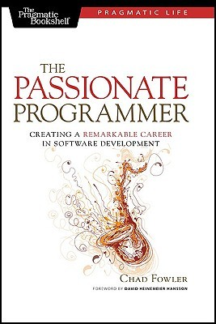

# The Passionate Programmer quotes API

A simple API to retrive quotes from **The Passionate Programmer** book.


[The Passionate Programmer]()

## Host

[https://us-central1-books-quotes-api.cloudfunctions.net/](https://us-central1-books-quotes-api.cloudfunctions.net/)
## API

### **GET**
**/getInfo** - get information about book (title and authors)

##### Example

> https://us-central1-books-quotes-api.cloudfunctions.net/getInfo

```
{"book":"The Passionate Programmer","autors":["Chd Fowler","David Heinemeier Hansson"]}
```

**/getRandomQuote** - get random quote from quotes list

##### Example

> https://us-central1-books-quotes-api.cloudfunctions.net/getRandomQuote

```
{"tip":"16","quote":"Know/learn Software Development Methodologies"}
```

**/getAllQuotes** - get all quotes from book

##### Example

> https://us-central1-books-quotes-api.cloudfunctions.net/getAllQuotes

```
[{"tip":"1","quote":"Keep on radar bleeding edge technologies vs sunset technologies"}, ..., {"tip":"53","quote":"Try to go independent (e.g. 2 hours/day after work hours) – how much did you earn?"}]
```

----
###### Inspired by https://github.com/shevabam/breaking-bad-quotes
